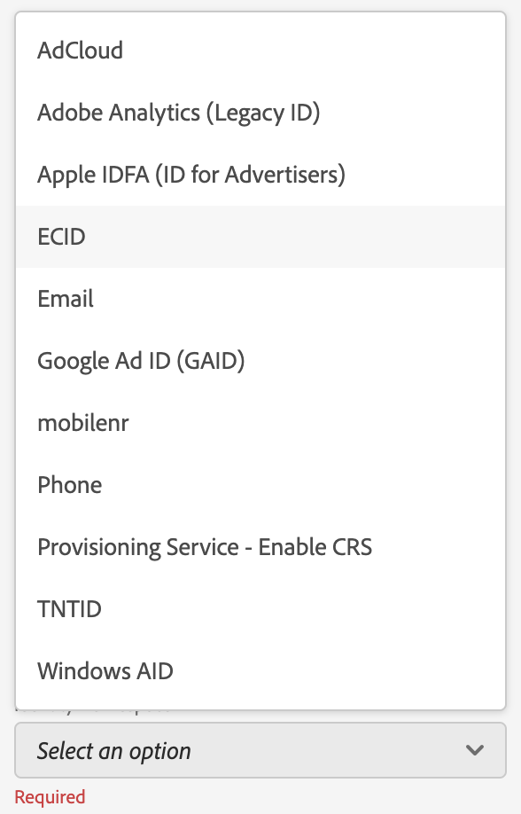
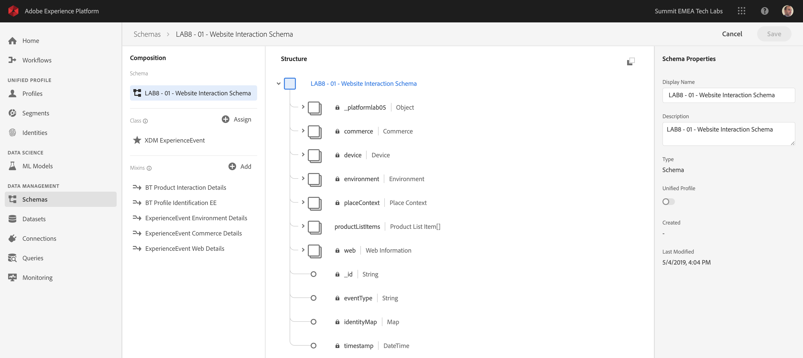

## Exercise 1 - Configure Schemas and Set Identifiers

In this exercise, you'll configure the required XDM schemas to classify profile information and customer behavior. In every XDM schema, you'll also have to configure a primary identifier to link all the information to.

The URL to login to Adobe Experience Platform is: [https://platform.adobe.com](https://platform.adobe.com)

**Attention!**

Please have a look at your computer's number and memorize it. As part of this exercise you'll need to specify your computer's number when you:

  * Create XDM Schema's
  * Create Datasets

 
### Story

Before you start configuring XDM Schema's and setting Primary Identifiers, we need to think about the business context of what we're trying to do: 

  * We Want Data
  * We Want to Link Data to a Customer
  * We Want to Build a Progressive, Unified Profile

There are 2 types of data that we want to capture:

  * Who is this customer?
  * What does this customer do?

However, the question ```Who is this customer?``` is a very open question that has many answers. When BT UK wants to see this question answered, they are looking for demographic information like First Name, Last Name and Address. But also for contact information like an Email Address or a Mobile Phone Number. Ans also for information linked to Language, OptIn/OptOut and maybe even Profile Pictures. And finally, what we really need to know, is how we'll be identifying this customer in the various systems that BT will use.

The same thing goes for the question ```What does this customer do?```. It's a very open question with many answers. When BT UK wants to see this question answered, they are looking for any interaction a customer has has had with any of their online properties. Which pages or products have been visited? Has this customer added a product to his cart or even purchased an item? What device and browser has been used to browse the website? What kind of information is this customer looking for and how can we use that to configure and deliver a delightful experience to this customer? And finally, what we really need to know, is how we'll be identifying this customer in the various systems that BT will use.

### Exercise 1.1 - Who is this customer?

Capturing the answer to ```Who is this customer?``` for BT is done through the Login/Registration-page.


From a Schema perspective, we look at this from a 'Class'-perspective. The question: ```Who is this customer?```is something that we define in the Class "Profile".

So when you create an XDM Schema to capture the answer to ```Who is this customer?```, first of all, you'll need to create and define 1 schema that references the class "Profile".

To specify what kind of answers can be given to that question, you'll need to define Mixins. Mixins are extensions of the Profile-class, and have very specific configurations. For instance, demographic information like First Name, Last Name, Gender and Birthday are part of the Mixin: ```Profile Person Details```.

Secondly, BT needs to decide how they will identify this customer. In the case of BT, the main identifier for a known customer will be a specific customer ID, like for instance an email address. But technically, there are other ways of identifying a customer at BT, like using a mobile phone number.
In this lab, we'll define the email address as the primary identifier and the phone number as a secondary identifier.

Lastly, it's important to distinguish the channel on which data was captured. In this case, we'll be talking about Website Registrations and the schema that needs to be defined needs to reflect ```Where``` the registration data was captured. The channel will also have an important role in influencing what data is captured. As such, it's a best practice to define schema's for every combination of channel, primary identifier and type of data collected.

Based on the above, you'll need to configure a Schema in Adobe Experience Platform.

Log in to Adobe Experience Platform by going to this URL: [https://platform.adobe.com](https://platform.adobe.com)

  * Your Username is: PS4-XX@adobeeventlab.com (XX = your computer number)
  * Your Password is: Adobe#Event10

After logging in, you'll land on the homepage of Adobe Experience Platform.


In Adobe Experience Platform, click on ```Schemas```in the menu on the left side of your screen.


In Schemas, you'll see a number of already defined schemas. 


You should create a new schema. To create a new schema, click on the button ```+ Create Schema```.


After clicking the ```+ Create Schema```button, you'll see an empty, new schema. 


Let's first name your schema. Please use the following naming for your schema:

Look at your computer and locate the computer's number.
**XX** = the number of your tech lab computer.

Example:

  * Computer 1 > replace XX with 01
  * Computer 75 > replace XX with 75

As the name for our schema, we'll use this:
**LAB8 - XX - Website Registration Schema**

Replace XX with your computer's number. 

Example:

  * Computer 1 > LAB8 - **01** - Website Registration Schema
  * Computer 75 > LAB8 - **75** - Website Registration Schema

That should give you something like this:


Next, you need to select the class of your schema. As indicated before, the class of your schema should be "XDM Profile". 
Click on the button ```+ Assign```


In the ```Assign Class```-window, select ```XDM Profile```.


Click the ```Assign Class```-button to assign the class.


You'll now see an overview of the minimal structure of your schema.


It's important to note that when eventually ingesting data against this schema, that some fields are required.
For instance, the field ```_id``` is a required field.

  * _id needs to contain a unique id for a specific data ingestion

Now you need to define what an answer to the question ```Who is this customer?``` should look like.
In the introduction of this lab, we noted the need for following attributes to define a customer:

  * Demographic information like First Name, Last Name and Address
  * Contact information like a Home Address, Email Address or a Mobile Phone Number
  * Other Information linked to Language, OptIn/OptOut and maybe even Profile Pictures. 
  * Primary Identifier for a customer

To make that information part of your schema, you need to add the following Mixins to your schema:

  * Profile Person Details (Demographic Information)
  * Profile Personal Details (Contact Information)
  * Profile Preferences Details (Other Information)
  * BT Profile Identification (Primary and Secondary Identifiers)

You can add these Mixins by clicking the ```+ Add```-button below the Class that you just defined.


Let's start with **Profile Person Details**.

Click the ```+ Add```-button to start adding a Mixin.

In the "Add Mixin"-screen, select the Mixin ```Profile Person Details```.


Click the ```Add Mixin```-button to add the Mixin to your schema.


Next, add the Mixin **Profile Personal Details**.

Click the ```+ Add```-button to start adding a Mixin.

In the "Add Mixin"-screen, select the Mixin ```Profile Personal Details```.


Click the ```Add Mixin```-button to add the Mixin to your schema.


Next, add the Mixin **Profile Preferences Details**.

Click the ```+ Add```-button to start adding a Mixin.

In the "Add Mixin"-screen, select the Mixin ```Profile Preferences Details```.


Click the ```Add Mixin```-button to add the Mixin to your schema.


Lastly, add the Mixin **BT Profile Identification**.

Click the ```+ Add```-button to start adding a Mixin.

In the "Add Mixin"-screen, select the Mixin ```BT Profile Identification```.


Click the ```Add Mixin```-button to add the Mixin to your schema.


You should now have this Schema structure in place.


The most important field in any XDM Schema is the primary identifier. We need to define the primary identifier in this schema now.

In the schema UI, click on the name of your schema to select it.

Next, click on the object ```_platformlab05``` in the schema.


This opens up the object ```identification```. 

Click on the object ```identification```.


You're now seeing 3 potential identifiers that we can choose from to define a primary identifier. In the case of Website Registration Information, we'll consider the email-address as the primary identifier.

Click on the field ```emailId```. 


By selecting the ```emailId```, the Field Properties for ```emailId``` are now shown on the right side of your screen.


The last property of the field ```emailId``` is the checkbox for ```Identity```.


Check the checkbox for ```Identity```


By checking that checkbox, you now have the option of defining this field as the Primary Identity.

Check the checkbox for Primary Identity.


By defining the field ```emailId``` as the Primary Identity, you now have to tell Adobe Experience Platform in which namespace to classify this identity.

By opening the dropdown-list, all available namespaces are shown. Logically, the field ```emailId``` should be linked to the namespace of ```Email```.


So finally, the Identity-configuration should look like this:


Click ```Apply``` to apply your changes.


Click ```Save``` to save your changes.


The last thing to do here, is to activate the Schema to be linked to the **Unified Profile**.
By enabling your schema for Unified Profile, you're making sure that all data sent to Adobe Experience Platform against this schema will be part of the Unified Profile environment, which makes sure that all that data can be used in real-time for querying and also for segmentation.

To do this, let's select the name of your schema.


In the right tab of your schema, you'll see a Unified Profile Switcher, which is currently deactivated.


Activate the Unified Profile - switch by clicking it.


You'll see this message:


Click ```Enable``` to enable this schema for Unified Profile.

Finally, click ```Save``` to save your schema.


### Exercise 1.2 - What does this customer do?

Capturing the answer to ```What does this customer do?``` for BT is done through f.i. a Product View on a Product Page.


From a Schema perspective, we look at this from a 'Class'-perspective. The question: ```What does this customer do?```is something that we've defined in the Class "ExperienceEvent".

So when you create an XDM Schema to capture the answer to ```Who is this customer?```, first of all, you'll need to create and define 1 schema that references the class "ExperienceEvent".

To specify what kind of answers can be given to that question, you'll need to define Mixins. Mixins are extensions of the Experience Event-class, and have very specific configurations. For instance, information about what kind of products a customer viewed or added to their cart is part of the Mixin ```ExperienceEvent Commerce Details```.

Secondly, BT needs to decide how they will identify the behavior of this customer. Since we're talking about interactions on a website, it's possible that BT knows the customer but it's equally possible that an unknown, anonymous visitor is active on the website. So we can't use an identifier like email-address. In this case, BT has decided to use the Experience Cloud ID (ECID) as the primary identifier.

Lastly, it's important to distinguish the channel on which data was captured. In this case, we'll be talking about Website Interactions and the schema that needs to be defined needs to reflect ```Where``` the interaction data was captured. The channel will also have an important role in influencing what data is captured. As such, it's a best practice to define schema's for every combination of channel, primary identifier and type of data collected.

Based on the above, you'll need to configure a Schema in Adobe Experience Platform.

Log in to Adobe Experience Platform by going to this URL: [https://platform.adobe.com](https://platform.adobe.com)

  * Your Username is: PS4-XX@adobeeventlab.com (XX = your computer number)
  * Your Password is: Adobe#Event10

After logging in, you'll land on the homepage of Adobe Experience Platform.


In Adobe Experience Platform, click on ```Schemas```in the menu on the left side of your screen.


In Schemas, you'll see a number of already defined schemas. 


You should create a new schema. To create a new schema, click on the button ```+ Create Schema```.


After clicking the ```+ Create Schema```button, you'll see an empty, new schema. 


Let's first name your schema. Please use the following naming for your schema:

Look at your computer and locate the computer's number.
**XX** = the number of your tech lab computer.

Example:

  * Computer 1 > replace XX with 01
  * Computer 75 > replace XX with 75

As the name for our schema, we'll use this:
**LAB8 - XX - Website Interaction Schema**

Replace XX with your computer's number. 

Example:

  * Computer 1 > LAB8 - **01** - Website Interaction Schema
  * Computer 75 > LAB8 - **75** - Website Interaction Schema

That should give you something like this:


Next, you need to select the class of your schema. As indicated before, the class of your schema should be "XDM ExperienceEvent". 
Click on the button ```+ Assign```


In the ```Assign Class```-window, select ```XDM ExperienceEvent ```.


Click the ```Assign Class```-button to assign the class.


You'll now see an overview of the minimal structure of your schema.


It's important to note that when eventually ingesting data against this schema, that some fields are required.
For instance, the fields ```_id``` and ```timestamp``` are required fields.

  * _id needs to contain a unique id for a specific data ingestion
  * timestamp needs to be the timestamp of this hit, in the format **"YYYY-MM-DDTHH:MM:SSZ"**, like f.i.: **"2019-04-08T07:20:00Z"**

Now you need to define what an answer to the question ```What does this customer do?``` should look like.
In the introduction of this lab, we noted the need for following attributes to define what a customer does:

  * Which pages or products have been visited? 
  * Has this customer added a product to his cart or even purchased an item? 
  * What device and browser has been used to browse the website? 
  * What kind of information is this customer looking for and how can we use that to configure and deliver a delightful experience to this customer?
  * Primary Identifier for a customer


To make that information part of your schema, you need to add the following Mixins to your schema:

  * ExperienceEvent Web Details
  * ExperienceEvent Commerce Details
  * ExperienceEvent Environment Details
  * BT Profile Identification EE (Primary and Secondary Identifiers)

You can add these Mixins by clicking the ```+ Add```-button below the Class that you just defined.


Let's start with **ExperienceEvent Web Details**.

Click the ```+ Add```-button to start adding a Mixin.

In the "Add Mixin"-screen, select the Mixin ```ExperienceEvent Web Details```.


Click the ```Add Mixin```-button to add the Mixin to your schema.


Next, add the Mixin **ExperienceEvent Commerce Details**.

Click the ```+ Add```-button to start adding a Mixin.

In the "Add Mixin"-screen, select the Mixin ```ExperienceEvent Commerce Details```.


Click the ```Add Mixin```-button to add the Mixin to your schema.


Next, add the Mixin **ExperienceEvent Environment Details**.

Click the ```+ Add```-button to start adding a Mixin.

In the "Add Mixin"-screen, select the Mixin ```ExperienceEvent Environment Details```.


Click the ```Add Mixin```-button to add the Mixin to your schema.


Next, add the Mixin **BT Profile Identification EE**.

Click the ```+ Add```-button to start adding a Mixin.

In the "Add Mixin"-screen, select the Mixin ```BT Profile Identification EE```.


Click the ```Add Mixin```-button to add the Mixin to your schema.


Lastly, add the Mixin **BT Product Interaction Details**.

Click the ```+ Add```-button to start adding a Mixin.

In the "Add Mixin"-screen, select the Mixin ```BT Product Interaction Details```.


Click the ```Add Mixin```-button to add the Mixin to your schema.


You should now have this Schema structure in place.


The most important field in any XDM Schema is the primary identifier. We need to define the primary identifier in this schema now.

To do that, click on the object ```_platformlab05``` in the schema.


This opens up the object ```identification```. 

Click on the object ```identification```.


You're now seeing 2 potential identifiers that we can choose from to define a primary identifier. In the case of Website Interactions, we'll consider the ecid as the primary identifier.

Click on the field ```ecid```. 


By selecting the ```ecid```, the Field Properties for ```ecid``` are now shown on the right side of your screen.


The last property of the field ```ecid``` is the checkbox for ```Identity```.


Check the checkbox for ```Identity```


By checking that checkbox, you now have the option of defining this field as the Primary Identity.

Check the checkbox for Primary Identity.


By defining the field ```ecid``` as the Primary Identity, you now have to tell Adobe Experience Platform in which namespace to classify this identity.

By opening the dropdown-list, all available namespaces are shown. Logically, the field ```ecid``` should be linked to the namespace of ```ECID```.



So finally, the Identity-configuration should look like this:


Click ```Apply``` to apply your changes.


Click ```Save``` to save your changes.


The last thing to do here, is to activate the Schema to be linked to the **Unified Profile**.
By enabling your schema for Unified Profile, you're making sure that all data sent to Adobe Experience Platform against this schema will be part of the Unified Profile environment, which makes sure that all that data can be used in real-time for querying and also for segmentation.

To do this, let's select the name of your schema.



In the right tab of your schema, you'll see a Unified Profile Switcher, which is currently deactivated.


Activate the Unified Profile - switch by clicking on it.


You'll see this message:


Click ```Enable``` to enable this schema for Unified Profile.

Finally, click ```Save``` to save your schema.


You've now finished building schemas that are activated to be used in the Real-Time Customer Profile.

Let's have a look at datasets in the next exercise.

---

[Next Step: Exercise 2 - Retrieve Datasets](./ex2.md)