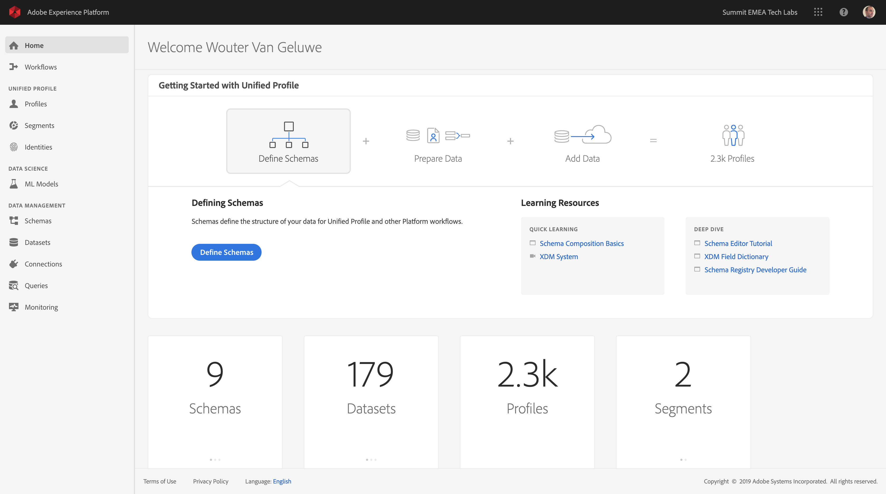
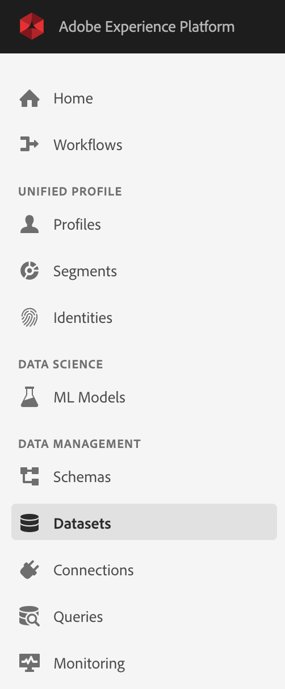
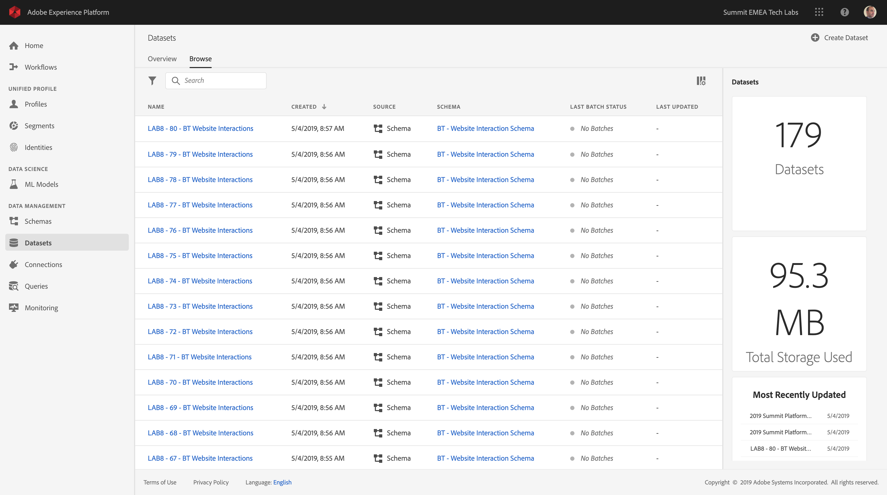
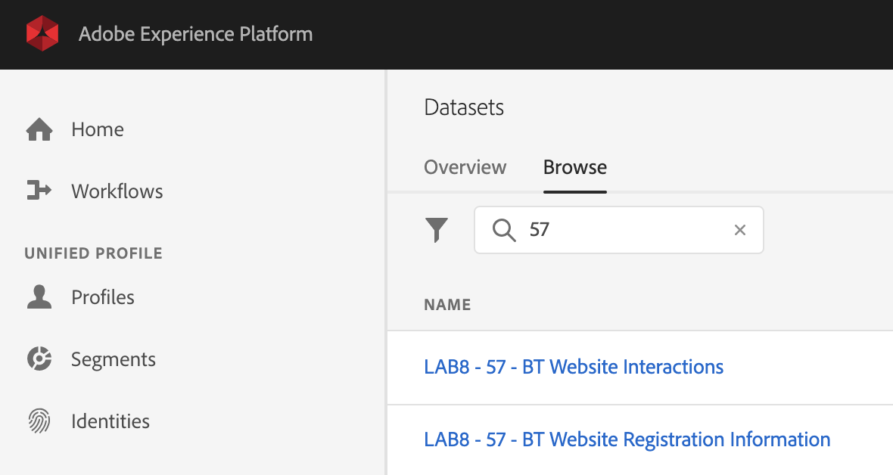

## Exercise 2 - Retrieve Datasets

In this exercise, you'll review the datasets that have already been configured to capture and store profile information and customer behavior. Every dataset that you create in this exercise uses schemas similar to the ones that you built in the previous step.

The URL to login to Adobe Experience Platform is: [https://platform.adobe.com](https://platform.adobe.com)

**Attention!**

Please have a look at your computer's number and memorize it. As part of this exercise you'll need to specify your computer's number when you:

  * Retrieve Datasets

 
### Story

After defining what the answer to the questions ```Who is this customer?``` and ```What does this customer do?``` should look like, you now need to create a bucket that stores that information, to receive and validate data that was sent to Adobe Experience Platform.

### Exercise 2.1 - Create Datasets

2 datasets have been created for you:

  * 1 dataset to capture the information that answers the ```Who is this customer?``` - question.
  * 1 dataset to capture the information that answers the ```What does this customer do?``` - question.

Log in to Adobe Experience Platform by going to this URL: [https://platform.adobe.com](https://platform.adobe.com)

  * Your Username is: PS4-XX@adobeeventlab.com (XX = your computer number)
  * Your Password is: Adobe#Event10

After logging in, you'll land on the homepage of Adobe Experience Platform.



In Adobe Experience Platform, click on ```Datasets``` in the menu on the left side of your screen.



In Datasets, you'll see a number of already defined datasets. 



Datasets for this lab have been predefined. 2 datasets for every computer have been created:

  * 1 dataset to capture Website Interactions
  * 1 dataset to capture Website Registration Information 

These datasets have been created already and are named like this:

  * Dataset to capture Website Interactions: **LAB8 - XX - BT Website Interactions**
  * Dataset to capture Website Registration Information: **LAB8 - XX - BT Website Registration Information**

To find your dataset, you have to replace **XX** with the number of your tech lab computer.

Example:
  * Computer 1 > replace XX with 01
  * Computer 75 > replace XX with 75

So, if your computer has the number 57, your datasets are named:

  * **LAB8 - 57 - BT Website Interactions**
  * **LAB8 - 57 - BT Website Registration Information**

To easily find these datasets, please enter your computer number (01, 02, 03, ..., 75) in the search box:



Remember these names, as you'll need them in the next exercise.

---

[Next Step: Exercise 3 - Create Streaming Endpoint](./ex3.md)