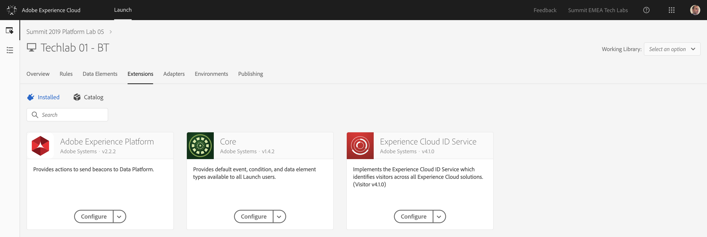

## Exercise 3 - Create Streaming Endpoint

In this exercise, you'll configure the required datasets to capture and store profile information and customer behavior. Every dataset that you create in this exercise will use one of the schemas that you built in the previous step.

The URL to login to Launch is: [https://launch-demo.adobe.com](https://launch-demo.adobe.com)

**Attention!**

Please have a look at your computer's number and memorize it. As part of this exercise you'll need to specify your computer's number when you:

  * Locate Launch Property
  * Create Streaming Dataset

 
### Story

After defining what the answer to the questions ```Who is this customer?``` and ```What does this customer do?``` should look like and creating a bucket to hold the data as answers, you should make sure that that data can be sent somewhere in real-time so that it can be consumed in real-time by Adobe Experience Platform. 
To send data to Adobe Experience Platform, you'll use Launch.

### Exercise 3.1 - Find your Launch Property

A part of the configuration in Launch has been prepared already. The following things have been configured for you:

  * Launch Property: Techlab XX - BT
  * Launch Extensions (Core and Experience Cloud ID Service)
  * Launch Data Elements
  * Launch Rules

The goal of this exercise is that you add and configure the new Launch Extension for Adobe Experience Platform.

Log in to Launch by going to this URL: [https://launch-demo.adobe.com](https://launch-demo.adobe.com)


In the list of Launch Properties, search for the property that was prepared for your computer.

If your computer:

  * has number 1, your Launch Property will be ```Techlab 01 - BT```
  * has number 75, your Launch Property will be ```Techlab 75 - BT```

In the search box, enter your computer number (don't forget the leading 0 for computer numbers 1 to 9).


Click on your Launch Property to open it.

In the Launch Menu, click on ```Extensions```.


You'll now see a list of installed extensions, which already contains the ```Core``` - extension and the ```Experience Cloud ID Service``` - extension.


Click on ```Catalog```


In the Catalog, enter ```Adobe Experience Platform``` in the search box, after which you'll get one result:


Click on ```Install``` to install the Adobe Experience Platform - extension.


In the Install Extension-screen, you'll see that there is only one option to define: the Streaming Endpoint.


You now have to create your own Streaming Endpoint.

To do this, click on the ```Create a streaming endpoint``` - button.


In the popup window, update the following fields:

  * Name: **TL XX Launch Streaming Endpoint**
  * Source ID: **Launch**

Replace XX with your computer's number. 

For instance:

  * If your computer's number is 1, you should have these values:
    * Name: **TL 01 Launch Streaming Endpoint**
    * Source ID: **Launch**
  * If your computer's number is 75, you should have these values:
    * Name: **TL 75 Launch Streaming Endpoint**
    * Source ID: **Launch**


Click ```Save``` to save your streaming endpoint.


You'll now see your streaming endpoint details.


Your Streaming Endpoint URL is now being shown. This means that all data captured by Launch will be sent to Adobe Experience Platform by making use of that specific URL.

Click ```Save``` once again to save your extension in your Launch Property.


After saving your changes, you should have this view in the extensions-tab.

 

Now that your Launch extensions are installed on your Launch property, you can go ahead and finalize the configuration of the Launch Rules.

---

[Next Step: Exercise 4 - Configure Launch Rules](./ex4.md)