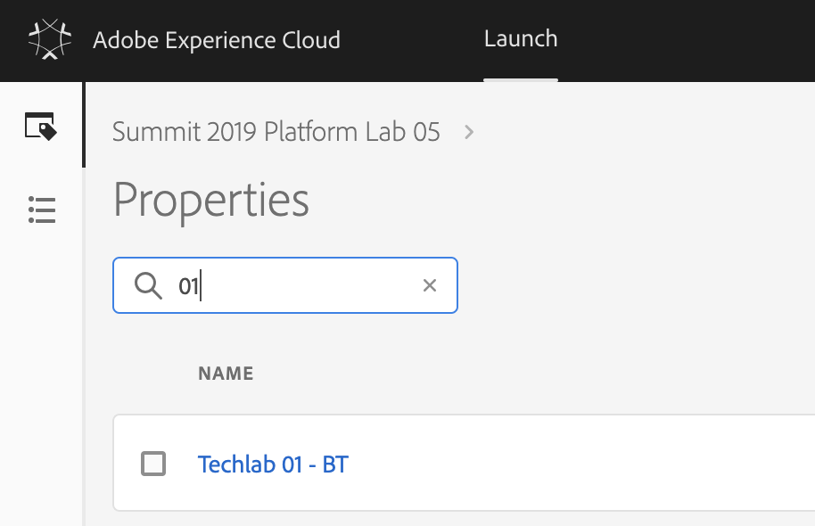

## Exercise 4 - Configure Launch Rules

In this exercise, you'll update 2 Launch Rules to capture customer profile attributes and customer behavior and send it to Adobe Experience Platform using the new Adobe Experience Platform extension that you configured in the previous step.

The URL to login to Launch is: [https://launch-demo.adobe.com](https://launch-demo.adobe.com)

**Attention!**

Please have a look at your computer's number and memorize it. As part of this exercise you'll need to specify your computer's number when you:

  * Locate Launch Property
  * Retrieve Datasets 
  * Configure Rules
 
### Story

After defining what the answer to the questions ```Who is this customer?``` and ```What does this customer do?``` should look like and creating a bucket to hold the data as answers, you should make sure that that data can be sent somewhere in real-time so that it can be consumed in real-time by Adobe Experience Platform. 
To send data to Adobe Experience Platform, you'll use Launch.

### Exercise 4.1 - Find your Launch Property

Log in to Launch by going to this URL: [https://launch-demo.adobe.com](https://launch-demo.adobe.com)


In the list of Launch Properties, search for the property that was prepared for your computer.

If your computer:

  * has number 1, your Launch Property will be ```Techlab 01 - BT```
  * has number 75, your Launch Property will be ```Techlab 75 - BT```

In the search box, enter your computer number (don't forget the leading 0 for computer numbers 1 to 9).



Click on your Launch Property to open it.

### Exercise 4.2 - Update Rule: All Product Pages

In the Launch Menu, click on ```Rules```.


In the ```Rules``` - screen, you'll find several already partially configured Launch Rules.


You now need to update each of those rules to send a beacon to Adobe Experience Platform.

Let's update the Rule ```All Product Pages```. Click the ```All Product Pages``` - rule to open it.


As you can see, the Event and Condition to trigger the rule are already defined.

What you need to do now, is add an ```Action```.

To add an action, click on the ```+ Add``` icon.


Our action will be to send the beacon to Platform, by configuring the options as follows:

| Extension                   | Action Type      | Name                                    |
|:---------------------------:| :---------------:| :-------------------------------------: |
| Adobe Experience Platform   | Send Beacon      | Adobe Experience Platform - Send Beacon |


After selecting the Platform - Send Beacon option, a dataset needs to be selected. In Exercise 2, you retrieved the 2 datasets to use:

* Website Interaction Dataset name: **LAB8 - XX - BT Website Interactions**

* Website Registration Information Dataset name: **LAB8 - XX - BT Website Registration Information**

For each of the above datasets, you have to replace XX by the number of your computer.

IMPORTANT!!! The dataset to use in this rule is: 
**LAB8 - XX - BT Website Interactions**

To select the Dataset, open up the Dataset dropdown list and enter your computer's number in the dropdown-field. After entering you computer's number, the dropdown-list will filter the results and you'll see your specific datasets.


Select the dataset: **LAB8 - XX - BT Website Interactions**


Next, in Identity Mapping, you need to define a Primary Identifier for this dataset. Our primary identifier for Experience Events will be the Experience Cloud ID. Configure your Identity Mapping as follows:


| Source Value | Identity Type              | Authenticated State|
|:-------------------------------------------| :------------------ |:------------------ |
|%customerECID%|ECID|Unknown|


In Schema Mapping, there's a visual way of selecting XDM-fields. By clicking on this icon:

 

With a click on that icon, you're able to open up the XDM Schema that is linked to the dataset **Techlab XX - Website Interactions**.


In Schema Mapping, You need to add the following Source Values and Target Schema Fields to the Send Beacon-action:

| Source Value                 | Target Schema Field               |
|:-------------------------------------------| :------------------ |
|%pageHitId%|_id| 
|%pageName%|web.webPageDetails.name|
|%pageTimeStamp%|timestamp|
|%pageUserAgent%|environment.browserDetails.userAgent|
|%customerLanguage%|environment.browserDetails.acceptLanguage|
|%customerECID%|_platformlab05.identification.ecid|
|%productName%|productListItems[0].SKU|
|%productImageUrl%|_platformlab05.productData.productImageUrl|
|%productName%|_platformlab05.productData.productName|
|%productInteraction%|_platformlab05.productData.productInteraction|


Attention! Check your configuration of the Source Values to be sure that after copying, no extra spaces are added in the keys as this may generate validation errors in Platform.

Click ```Keep Changes``` to save your Action.

Click ```Save``` to save your Rule.

### Exercise 4.3 - Update Rule: All Authenticated Pages

In the Launch Menu, click on ```Rules```.


In the ```Rules``` - screen, you'll find several already partially configured Launch Rules.


You now need to update each of those rules to send a beacon to Adobe Experience Platform.

Let's update the Rule ```All Authenticated Pages```. Click the ```All Authenticated Pages``` - rule to open it.


As you can see, the Event and Condition to trigger the rule are already defined.

What you need to do now, is add an ```Action```.

To add an action, click on the ```+``` icon next to the action ```Experience Cloud ID Service - Set Customer IDs```.


Our action will be to send the beacon to Platform, by configuring the options as follows:

| Extension                   | Action Type      | Name                                    |
|:---------------------------:| :---------------:| :-------------------------------------: |
| Adobe Experience Platform   | Send Beacon      | Adobe Experience Platform - Send Beacon |


After selecting the Platform - Send Beacon option, a dataset needs to be selected. In Exercise 2, you retrieved the 2 datasets to use:

* Website Interaction Dataset name: **LAB8 - XX - BT Website Interactions**

* Website Registration Information Dataset name: **LAB8 - XX - BT Website Registration Information**

For each of the above datasets, you have to replace XX by the number of your computer.

IMPORTANT!!! The dataset to use in this rule is: 
**LAB8 - XX - BT Website Registration Information**

To select the Dataset, open up the Dataset dropdown list and enter your computer's number in the dropdown-field. After entering you computer's number, the dropdown-list will filter the results and you'll see your specific datasets.


Select the dataset: **LAB8 - XX - BT Website Registration Information**


Next, in Identity Mapping, you need to define a Primary Identifier for this dataset. Our primary identifier for Experience Events will be the Email ID. Configure your Identity Mapping as follows:

| Source Value | Identity Type              | Authenticated State|
|:-------------------------------------------| :------------------ |:------------------ |
|%customerEmail%|Email|Authenticated|


In Schema Mapping, there's a visual way of selecting XDM-fields. By clicking on this icon:

 

With a click on that icon, you're able to open up the XDM Schema that is linked to the dataset **LAB8 - XX - BT Website Registration Information**.


In Schema Mapping, You need to add the following Source Values and Target Schema Fields to the Send Beacon-action:

| Source Value                                        | Target Schema Field               |
|:-------------------------------------------| :------------------ |
|%customerFirstName%|person.name.firstName|
|%customerLastName%|person.name.lastName|
|%customerEmail%|personalEmail.address|
|%customerEmail%|_platformlab05.identification.emailId|
|%pageTimeStamp%|\_repo.createDate|
|%customerGender%|person.gender| 
|%customerStreet%|homeAddress.street1|
|%customerCity%|homeAddress.city|
|%customerPostalCode%|homeAddress.postalCode|
|%customerCountryName%|homeAddress.country|
|%customerPictureImgUrl%|profilePictureLink|
|%customerMobileNr%|mobilePhone.number|
|%customerMobileNr%|_platformlab05.identification.mobilenr|
|%customerECID%|_platformlab05.identification.ecid|


Attention! Check your configuration of the Source Values to be sure that after copying, no extra spaces are added in the keys as this may generate validation errors in Platform.

Click ```Keep Changes``` to save your Action.

Click ```Save``` to save your Rule.

Your Launch Rules are now configured. It's time to publish your configuration and condfigure your website to use this Launch property.

---

[Next Step: Exercise 5 - Publish your configuration on the BT website](./ex5.md)