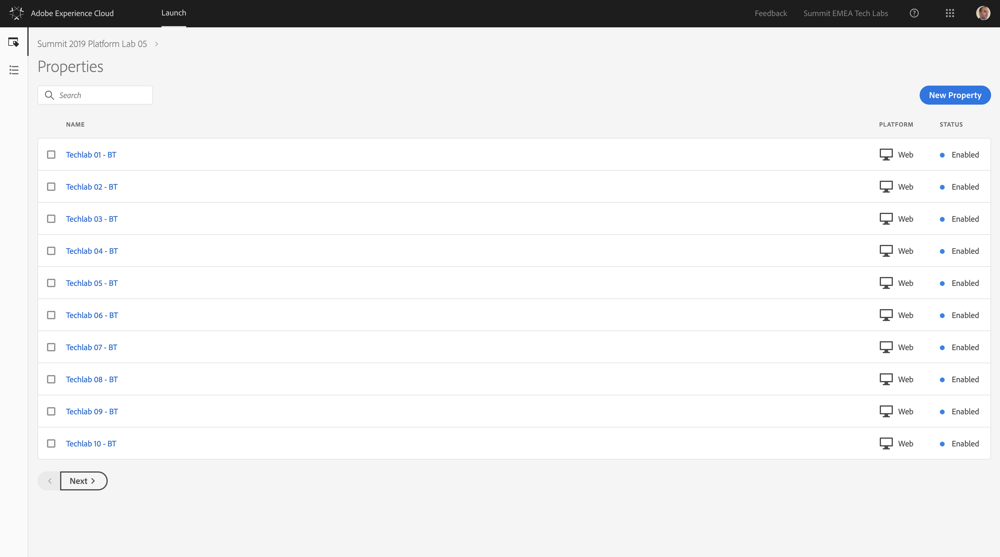
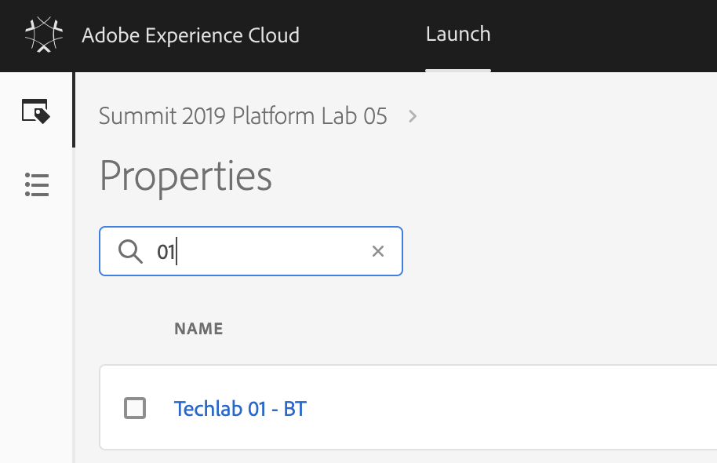
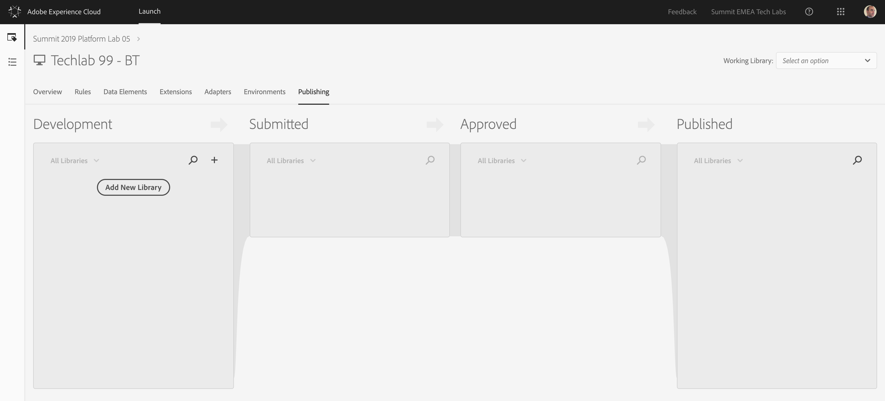
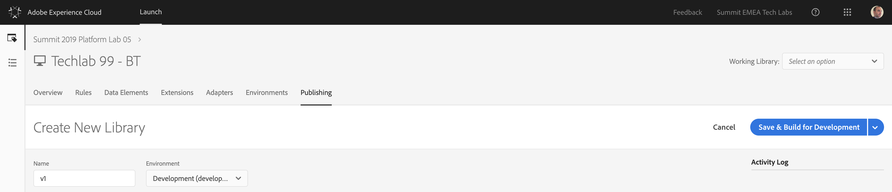
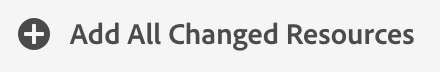
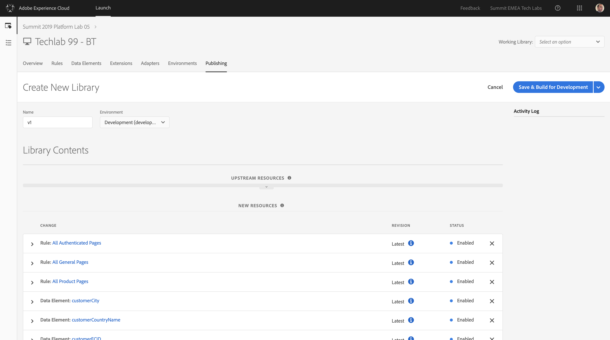
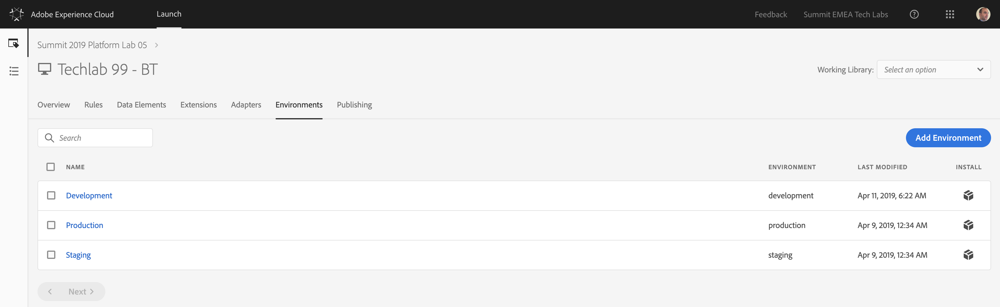
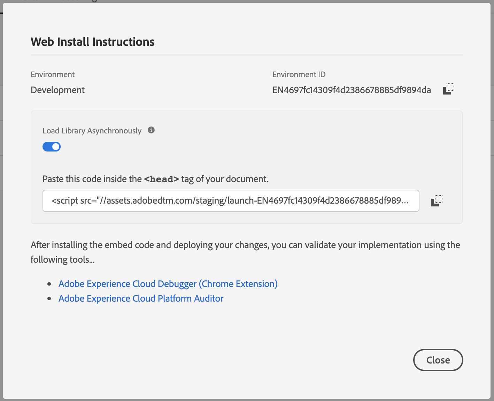
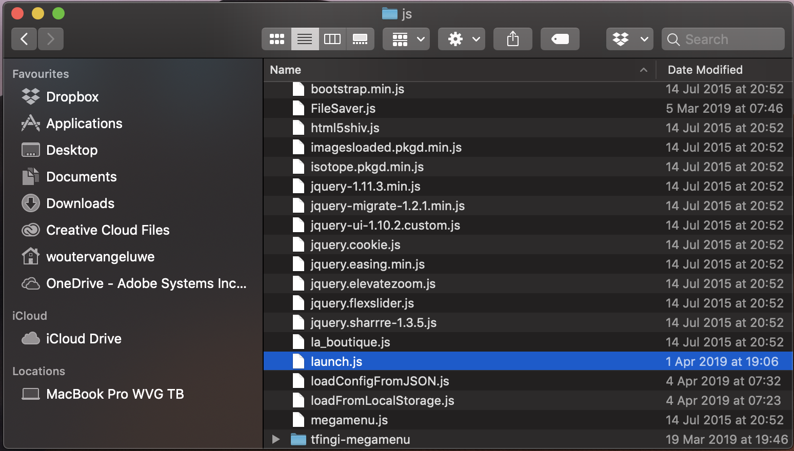
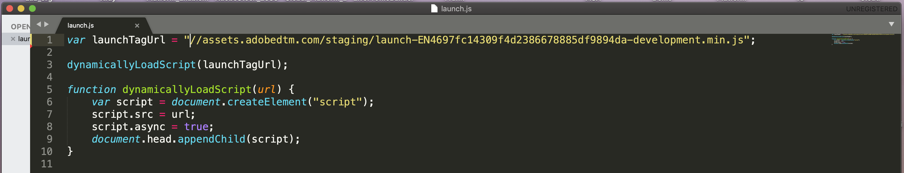

## Exercise 5 - Publish your configuration on the BT website

In this exercise, you'll publish your Launch configuration and make sure that your local BT website uses your Launch configuration.

The URL to login to Launch is: [https://launch-demo.adobe.com](https://launch-demo.adobe.com)

### Story

After defining what the answer to the questions ```Who is this customer?``` and ```What does this customer do?``` should look like and creating a bucket to hold the data as answers, you should make sure that that data can be sent somewhere in real-time so that it can be consumed in real-time by Adobe Experience Platform. 
To send data to Adobe Experience Platform, you'll use Launch.

### Exercise 5.1 - Publish your Launch configuration

Go to [https://launch-demo.adobe.com/](https://launch-demo.adobe.com/) and login with your personal login details.



In the list of Launch Properties, search for the property that was prepared for your computer.

If your computer:

  * has number 1, your Launch Property will be ```Techlab 01 - BT```
  * has number 75, your Launch Property will be ```Techlab 75 - BT```

Enter your computer's number in the searchbox (don't forget to include the leading 0 for computer number 1 to 9).



Click on your Launch Property to open it.

In the Launch UI, navigate to the menu option "Publishing".



Click the ```Add New Library``` - button

Enter as Name ```v1``` and select the Development environment from the dropdown list.



Click on the ```Add All Changed Resources``` - button, after which you should see all the elements that you configured pop up in the ```New Resources``` - list.





Click the ```Save & Build for Development```-button.

Your new Library is now being built!

To implement the new library on your local BT website, navigate to the ```Environments```-tab in the Launch UI.



Locate your Development Environment, and click on the ```Install``` - icon on the right side of the screen:


You'll see a screen like this one, which contains the tag to implement on the website:



Don't copy the full <head> tag. You need to select a subset of the tag, which is basically the src of the tag. 

So don't copy everything, but only select and copy the text between the quotes of the src, like this:

```//assets.adobedtm.com/staging/launch-EN4697fc14309f4d2386678885df9894da-development.min.js```


### Exercise 5.2 - Update your BT website configuation

Go to the folder Applications > MAMP > htdocs > js and locate the launch.js file



Open the file launch.js using a text editor.


Go to Line 1, where you'll see the following:

```javascript
var launchTagUrl = ""
```

On Line 1, replace "" with the src of your launch tag:

```//assets.adobedtm.com/staging/launch-EN4697fc14309f4d2386678885df9894da-development.min.js```

This should be the result:

```javascript
var launchTagUrl = "//assets.adobedtm.com/staging/launch-EN4697fc14309f4d2386678885df9894da-development.min.js"
```



Save your changes in the launch.js file and reload your BT website.

After this change, your website and configuration are ready to send data to Adobe Experience Platform!

---

[Next Step: Exercise 6 - Stream Data to Adobe Experience Platform](./ex6.md)