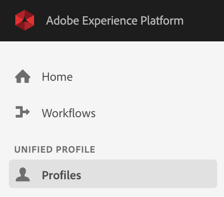
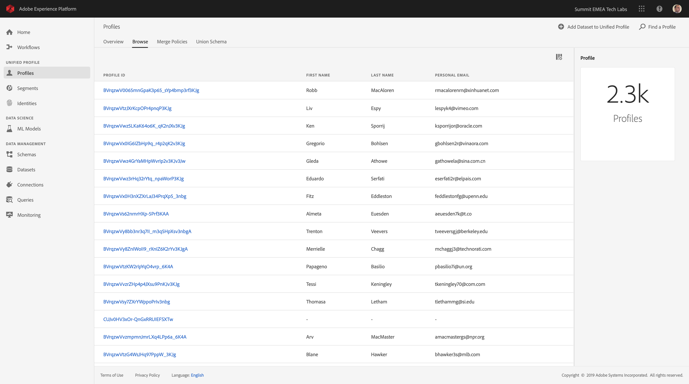
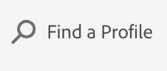
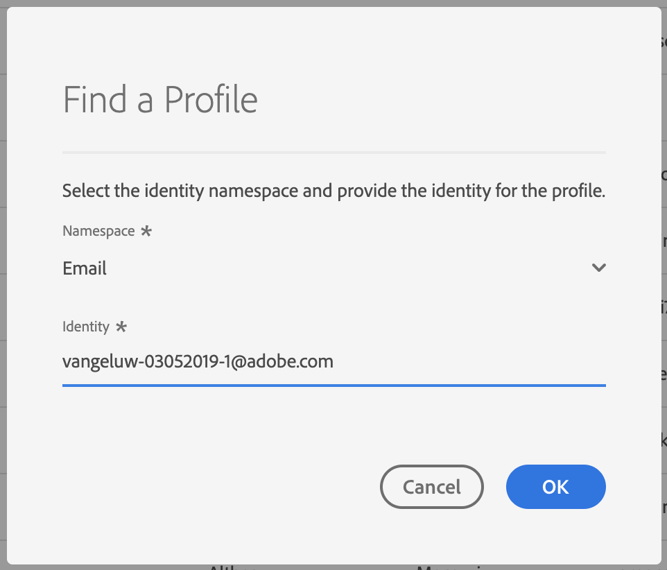
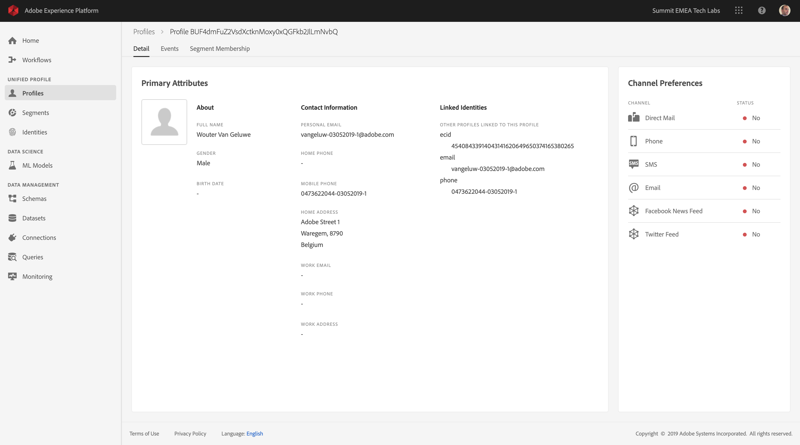
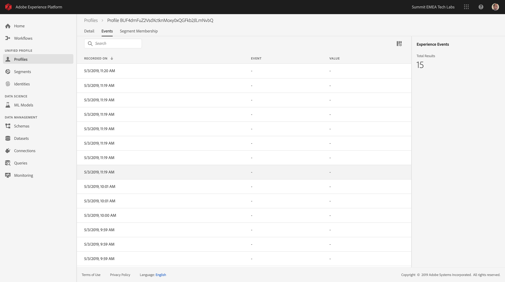

## Exercise 6 - Stream Data to Adobe Experience Platform

In this exercise, you'll be going onto your local BT website and act like a customer to then verify that your data is ingested successfully in Adobe Experience Platform

The URL to login to Adobe Experience Platform is: [https://platform.adobe.com](https://platform.adobe.com)

**Attention!**

### Exercise 6.1 - Explore BT website

Go to to [http://lab08.bt.com/](http://lab08.bt.com).


In the site's menu, click on Broadband Deals to visit that page.


In the site's menu, click on TV & Broadband Deals to visit that page.


Go to the Login/Register page and fill out your own details to register. Click "Create Account" to create your account.


### Exercise 6.2 - View Profile Information

Login to Adobe Experience Platform by following this URL: [https://platform.adobe.com](https://platform.adobe.com)

In the left menu, select ```Profiles```.



You'll see the Profiles landing page which allows you to browse and search for a Profile.



Click on Find a Profile



Select the ```Namespace``` of ```Email``` and in the ```Identity``` - field, enter the ```email-address``` that you used to create your account.



Click ```OK```.


You should now see an overview of your Profile which displays the information that you entered on the Registration page.



By going to the tab ```Events```, you will see a number of entries, representing your activity on the BT website.



Congratulations! You've successfully finished this Tech Lab! 

---