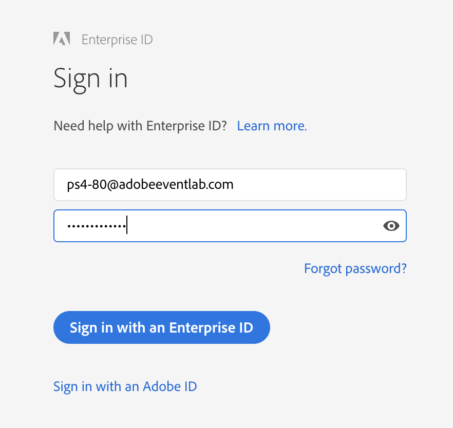

## Before we start...

In this tech lab, you will need a couple of things in order to successfully walk through the content.

  * Your Computer's number
  * Your Username
  * Your Password

You can find this information on your desktop, where you'll see similar information:

During the exercises, you'll have to login a number of times in Adobe Experience Platform and Adobe Experience Platform Launch.

Your username is on your desktop in the upper left corner of your screen and looks like this:
**PS4-XX@adobeeventlab.com**

Your password is on your desktop in the upper left corner of your screen and is:
**Adobe#Event10**

To avoid typo's, it's a good idea to copy your password from here and paste it when logging in.

Your Computer Number is a number between **01** and **75**, you can find it in the upper left corner of your screen.

To login, go to [https://platform.adobe.com](https://platform.adobe.com)

When logging in to Adobe Experience Platform solutions, you'll have to enter the username and password during the sign-in process, after which you'll be signing in with an Enterprise ID.

Full list of User Names and Passwords:

| Number | Username              | Password   |                                    
|:---------|:----------------------| :----------| 
|01|PS4-01@adobeeventlab.com|Adobe#Event10| 
|02|PS4-02@adobeeventlab.com|Adobe#Event10| 
|03|PS4-03@adobeeventlab.com|Adobe#Event10| 
|04|PS4-04@adobeeventlab.com|Adobe#Event10| 
|05|PS4-05@adobeeventlab.com|Adobe#Event10| 
|06|PS4-06@adobeeventlab.com|Adobe#Event10| 
|07|PS4-07@adobeeventlab.com|Adobe#Event10| 
|08|PS4-08@adobeeventlab.com|Adobe#Event10| 
|09|PS4-09@adobeeventlab.com|Adobe#Event10| 
|10|PS4-10@adobeeventlab.com|Adobe#Event10| 
|11|PS4-11@adobeeventlab.com|Adobe#Event10| 
|12|PS4-12@adobeeventlab.com|Adobe#Event10| 
|13|PS4-13@adobeeventlab.com|Adobe#Event10| 
|14|PS4-14@adobeeventlab.com|Adobe#Event10| 
|15|PS4-15@adobeeventlab.com|Adobe#Event10| 
|16|PS4-16@adobeeventlab.com|Adobe#Event10| 
|17|PS4-17@adobeeventlab.com|Adobe#Event10| 
|18|PS4-18@adobeeventlab.com|Adobe#Event10| 
|19|PS4-19@adobeeventlab.com|Adobe#Event10| 
|20|PS4-20@adobeeventlab.com|Adobe#Event10| 
|21|PS4-21@adobeeventlab.com|Adobe#Event10| 
|22|PS4-22@adobeeventlab.com|Adobe#Event10| 
|23|PS4-23@adobeeventlab.com|Adobe#Event10| 
|24|PS4-24@adobeeventlab.com|Adobe#Event10| 
|25|PS4-25@adobeeventlab.com|Adobe#Event10| 
|26|PS4-26@adobeeventlab.com|Adobe#Event10| 
|27|PS4-27@adobeeventlab.com|Adobe#Event10| 
|28|PS4-28@adobeeventlab.com|Adobe#Event10| 
|29|PS4-29@adobeeventlab.com|Adobe#Event10| 
|30|PS4-30@adobeeventlab.com|Adobe#Event10| 
|31|PS4-31@adobeeventlab.com|Adobe#Event10| 
|32|PS4-32@adobeeventlab.com|Adobe#Event10| 
|33|PS4-33@adobeeventlab.com|Adobe#Event10| 
|34|PS4-34@adobeeventlab.com|Adobe#Event10| 
|35|PS4-35@adobeeventlab.com|Adobe#Event10| 
|36|PS4-36@adobeeventlab.com|Adobe#Event10| 
|37|PS4-37@adobeeventlab.com|Adobe#Event10| 
|38|PS4-38@adobeeventlab.com|Adobe#Event10| 
|39|PS4-39@adobeeventlab.com|Adobe#Event10| 
|40|PS4-40@adobeeventlab.com|Adobe#Event10| 
|41|PS4-41@adobeeventlab.com|Adobe#Event10| 
|42|PS4-42@adobeeventlab.com|Adobe#Event10| 
|43|PS4-43@adobeeventlab.com|Adobe#Event10| 
|44|PS4-44@adobeeventlab.com|Adobe#Event10| 
|45|PS4-45@adobeeventlab.com|Adobe#Event10| 
|46|PS4-46@adobeeventlab.com|Adobe#Event10| 
|47|PS4-47@adobeeventlab.com|Adobe#Event10| 
|48|PS4-48@adobeeventlab.com|Adobe#Event10| 
|49|PS4-49@adobeeventlab.com|Adobe#Event10| 
|50|PS4-50@adobeeventlab.com|Adobe#Event10| 
|51|PS4-51@adobeeventlab.com|Adobe#Event10| 
|52|PS4-52@adobeeventlab.com|Adobe#Event10| 
|53|PS4-53@adobeeventlab.com|Adobe#Event10| 
|54|PS4-54@adobeeventlab.com|Adobe#Event10| 
|55|PS4-55@adobeeventlab.com|Adobe#Event10| 
|56|PS4-56@adobeeventlab.com|Adobe#Event10| 
|57|PS4-57@adobeeventlab.com|Adobe#Event10| 
|58|PS4-58@adobeeventlab.com|Adobe#Event10| 
|59|PS4-59@adobeeventlab.com|Adobe#Event10| 
|60|PS4-60@adobeeventlab.com|Adobe#Event10| 
|61|PS4-61@adobeeventlab.com|Adobe#Event10| 
|62|PS4-62@adobeeventlab.com|Adobe#Event10| 
|63|PS4-63@adobeeventlab.com|Adobe#Event10| 
|64|PS4-64@adobeeventlab.com|Adobe#Event10| 
|65|PS4-65@adobeeventlab.com|Adobe#Event10| 
|66|PS4-66@adobeeventlab.com|Adobe#Event10| 
|67|PS4-67@adobeeventlab.com|Adobe#Event10| 
|68|PS4-68@adobeeventlab.com|Adobe#Event10| 
|69|PS4-69@adobeeventlab.com|Adobe#Event10| 
|70|PS4-70@adobeeventlab.com|Adobe#Event10| 
|71|PS4-71@adobeeventlab.com|Adobe#Event10| 
|72|PS4-72@adobeeventlab.com|Adobe#Event10| 
|73|PS4-73@adobeeventlab.com|Adobe#Event10| 
|74|PS4-74@adobeeventlab.com|Adobe#Event10| 
|75|PS4-75@adobeeventlab.com|Adobe#Event10| 
|76|PS4-76@adobeeventlab.com|Adobe#Event10| 
|77|PS4-77@adobeeventlab.com|Adobe#Event10| 
|78|PS4-78@adobeeventlab.com|Adobe#Event10| 
|79|PS4-79@adobeeventlab.com|Adobe#Event10| 
|80|PS4-80@adobeeventlab.com|Adobe#Event10| 

---